# Claude Essentials: Workflow Diagrams

## Complete Workflow: Idea to Completion

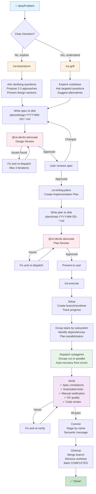

## Brainstorming Workflow

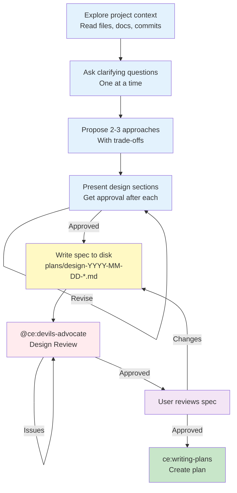

## Grilling Workflow

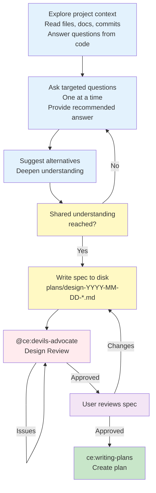

## Planning Workflow

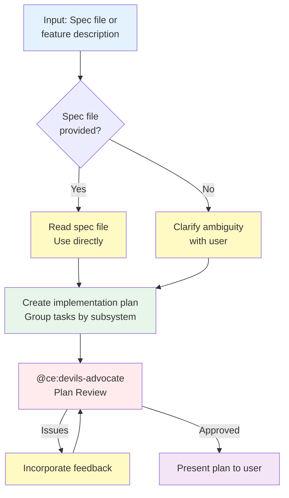

## Execution Workflow

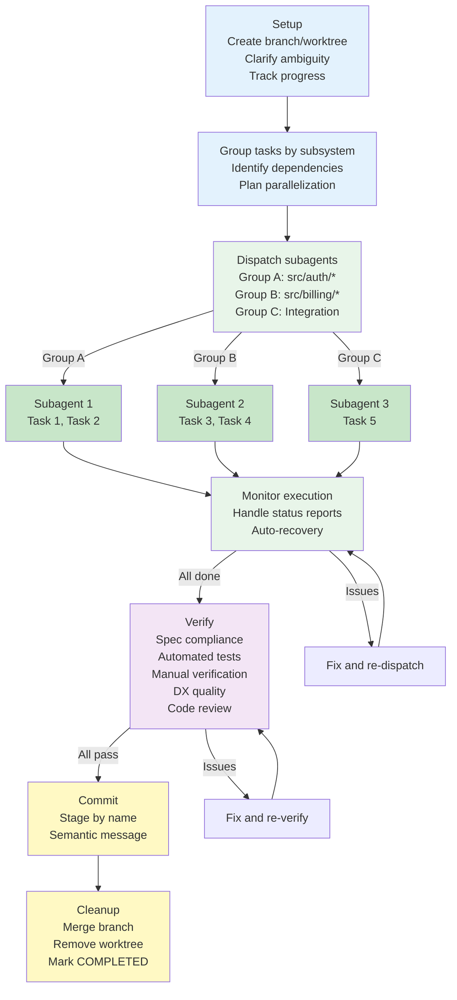

## Task Grouping & Parallelization

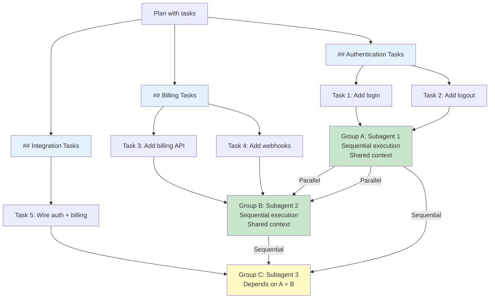

## Code Review Dimensions

```mermaid
graph TD
    A["@ce:code-reviewer-opus + @ce:code-reviewer-sonnet<br/>Dual-Model PR Review"]
    
    A --> B["Correctness"]
    B --> B1["Logic errors"]
    B --> B2["Bugs & edge cases"]
    B --> B3["Error handling"]
    
    A --> C["Security"]
    C --> C1["Vulnerabilities"]
    C --> C2["Input validation"]
    C --> C3["Sensitive data"]
    
    A --> D["Performance"]
    D --> D1["Algorithmic complexity"]
    D --> D2["Memory leaks"]
    D --> D3["Unnecessary re-renders"]
    
    A --> E["Maintainability"]
    E --> E1["Code clarity"]
    E --> E2["Naming"]
    E --> E3["Structure"]
    
    A --> F["Conventions"]
    F --> F1["Pattern alignment"]
    F --> F2["Deviations"]
    
    A --> G["Architecture"]
    G --> G1["Separation of concerns"]
    G --> G2["API design"]
    G --> G3["Module boundaries"]
    
    A --> H["Product & UX"]
    H --> H1["User flow completeness"]
    H --> H2["Edge cases"]
    H --> H3["Accessibility"]
    
    A --> I["Developer Experience"]
    I --> I1["API intuitiveness"]
    I --> I2["Error messages"]
    I --> I3["Extension points"]
    
    A --> J["Documentation"]
    J --> J1["README updates"]
    J --> J2["API docs"]
    J --> J3["Code comments"]
    
    style A fill:#ffebee
    style B fill:#ffcdd2
    style C fill:#ffcdd2
    style D fill:#ffcdd2
    style E fill:#ffcdd2
    style F fill:#ffcdd2
    style G fill:#ffcdd2
    style H fill:#ffcdd2
    style I fill:#ffcdd2
    style J fill:#ffcdd2
```

## Skill Activation Sequence

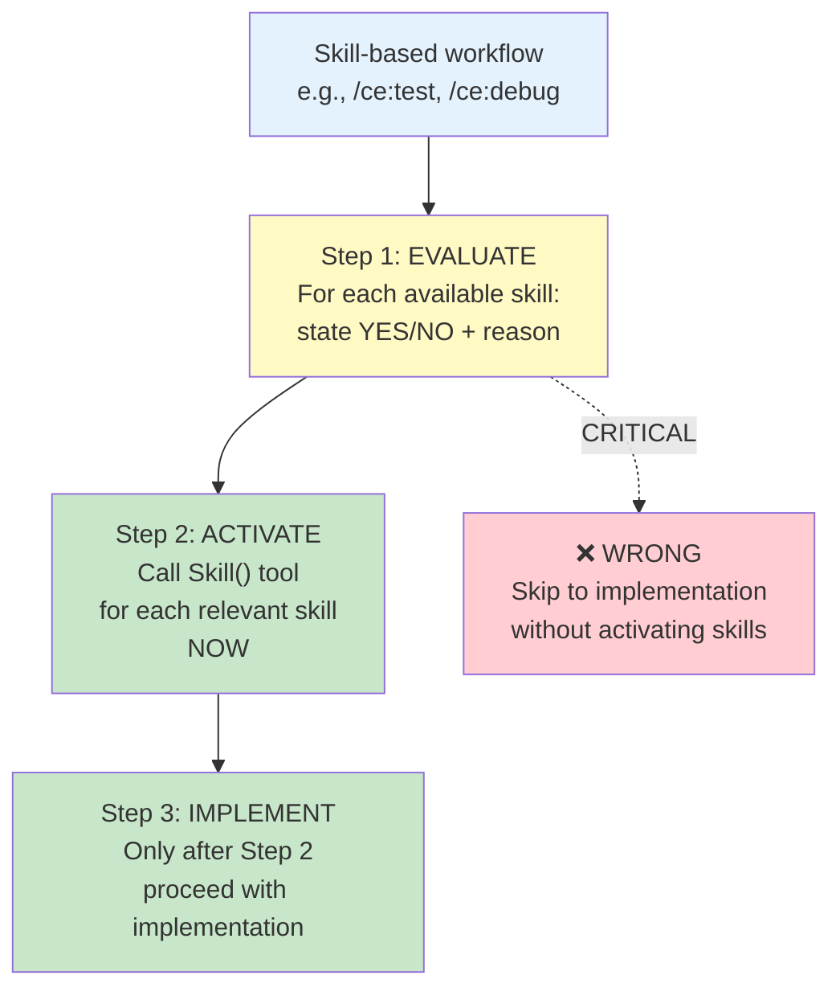

## Verification Checklist

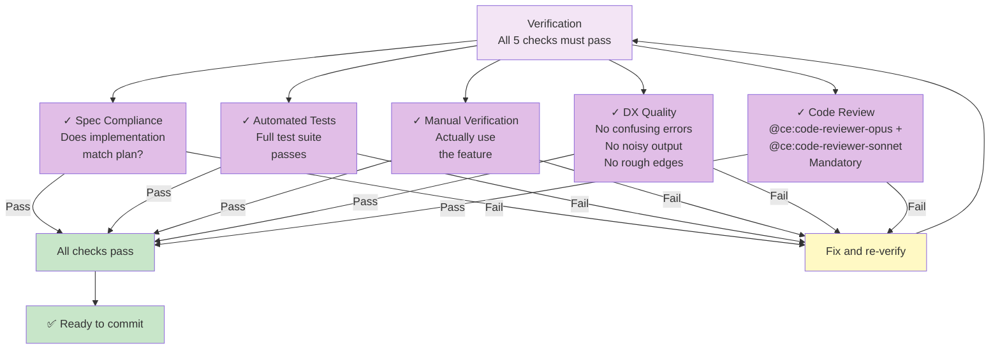

## Agent Roles

```mermaid
graph TD
    A["AI Agents"]
    
    A --> B["@ce:code-reviewer-opus"]
    B --> B1["Deep, nuanced PR reviews"]
    B --> B2["Technical, product, DX"]
    B --> B3["Mandatory in execution"]
    
    A --> B4["@ce:code-reviewer-sonnet"]
    B4 --> B5["Fast, broad PR reviews"]
    B4 --> B6["Technical, product, DX"]
    B4 --> B7["Runs in parallel with Opus"]
    
    A --> C["@ce:devils-advocate"]
    C --> C1["Rigorous critique"]
    C --> C2["Find real flaws"]
    C --> C3["Review plans & specs"]
    
    A --> D["@ce:haiku"]
    D --> D1["Lightweight agent"]
    D --> D2["Simple delegated tasks"]
    
    A --> E["@ce:log-reader"]
    E --> E1["Log analysis"]
    E --> E2["Targeted search"]
    
    A --> F["@ce:context-auditor"]
    F --> F1["Documentation gaps"]
    F --> F2["Knowledge audit"]
    
    style A fill:#e8eaf6
    style B fill:#c5cae9
    style C fill:#c5cae9
    style D fill:#c5cae9
    style E fill:#c5cae9
    style F fill:#c5cae9
```

## File Organization

```
project/
├── plans/
│   ├── design-YYYY-MM-DD-feature1.md      # Design spec
│   ├── impl-YYYY-MM-DD-feature1.md        # Implementation plan
│   ├── design-YYYY-MM-DD-feature2.md
│   ├── impl-YYYY-MM-DD-feature2.md
│   └── done/                              # Completed plans
│       └── impl-YYYY-MM-DD-feature1.md
│
├── .claude/
│   ├── CLAUDE.md                          # Project instructions
│   ├── settings.json                      # Permissions
│   └── rules/
│       ├── testing.md
│       ├── error-handling.md
│       └── {stack}/
│
└── src/
    ├── feature1/
    ├── feature2/
    └── ...
```

## Plugin Architecture

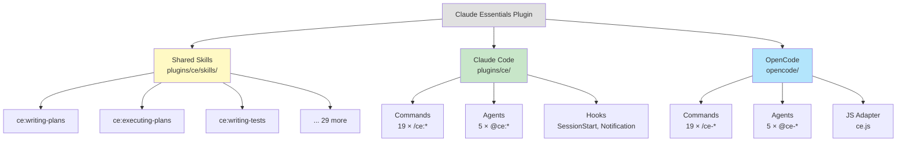

## Typical Workflows

### New Feature (Complete Cycle)

```
/ce:brainstorm "Add real-time notifications"
    ↓
plans/design-YYYY-MM-DD-notifications.md
    ↓
@ce:devils-advocate (design review)
    ↓
User reviews spec
    ↓
/ce:plan plans/design-YYYY-MM-DD-notifications.md
    ↓
plans/impl-YYYY-MM-DD-notifications.md
    ↓
@ce:devils-advocate (plan review)
    ↓
/ce:execute plans/impl-YYYY-MM-DD-notifications.md
    ↓
Subagents execute task groups in parallel
    ↓
Verify (tests, manual, DX, code review)
    ↓
Commit & merge
    ↓
✅ Done!
```

### Bug Fix (Quick Cycle)

```
/ce:debug
    ↓
Systematic debugging (understand, reproduce, isolate, fix)
    ↓
/ce:test
    ↓
Run tests, analyze failures
    ↓
/ce:commit
    ↓
Preflight checks, semantic commit
    ↓
✅ Done!
```

### Code Review Before Merge

```
/ce:review
    ↓
Tracked findings as checklist
    ↓
Fix issues
    ↓
/ce:commit
    ↓
✅ Ready to merge!
```
