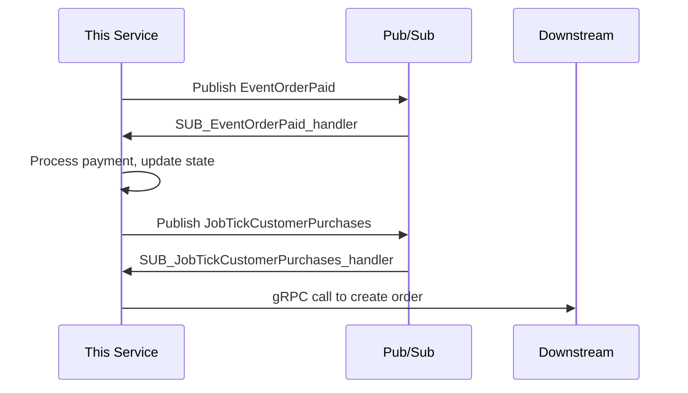

# Data Flow Exploration

Use this lens when the user wants to understand how requests move through the system, how events chain together, or how pub/sub orchestration works.

## Approach

### 1. Trace a Request End-to-End

Pick a concrete user action (e.g., "customer purchases an offering") and trace it through every layer:

```
User Action
  → API Gateway (GraphQL BFF)
    → gRPC call to this service
      → Validation
        → Database transaction
          → Side effects (events published, external calls)
            → Downstream service reactions
```

For each step, reference the actual file and function. The user should be able to follow along in their editor.

### 2. Map the Event Chain

For event-driven flows, draw the full pub/sub chain:



For each event in the chain:
- **Publisher**: Which function publishes it and under what conditions
- **Subscriber**: Which handler processes it
- **Payload**: What data the event carries (reference the proto or type definition)
- **Idempotency**: How the handler deals with duplicate messages
- **Failure mode**: What happens if this step fails (retry? dead letter? manual intervention?)

### 3. Identify Orchestration Patterns

Look for these common patterns:

| Pattern | How to spot it | What it means |
|---------|---------------|---------------|
| **Job fan-out** | One event publishes N child events | Orchestrator breaks work into parallelizable units |
| **Saga** | Multiple events with compensating actions | Distributed transaction across services |
| **Event sourcing** | Append-only ledger, state derived from events | Current state is computed, not stored directly |
| **Choreography** | No central coordinator, services react to events | Loose coupling but harder to trace the full flow |

### 4. Highlight the RPC Patterns

For gRPC services, explain:

**Request handling:**
- How the service context gets threaded through
- Where validation happens (before business logic, not after)
- How errors map to gRPC status codes
- Whether the RPC is read-only (uses `dbRead`) or read-write (uses `db`)

**Common RPC shapes:**
- `getXByIds` / `getXByFilters` — batch read patterns
- `createX` / `updateX` — write with validation
- `complexVerb` (e.g., `purchaseOfferings`) — multi-step business operations

For complex RPCs (anything over ~200 lines), break down the phases: validation → authorization → business logic → persistence → side effects.

## Exploration Questions Template

After tracing a data flow, suggest questions like:
- "What happens if [middle step] fails after [earlier step] already committed?"
- "How does the system ensure [this event] is processed exactly once?"
- "Where does [this piece of data] originally come from before it reaches this service?"
