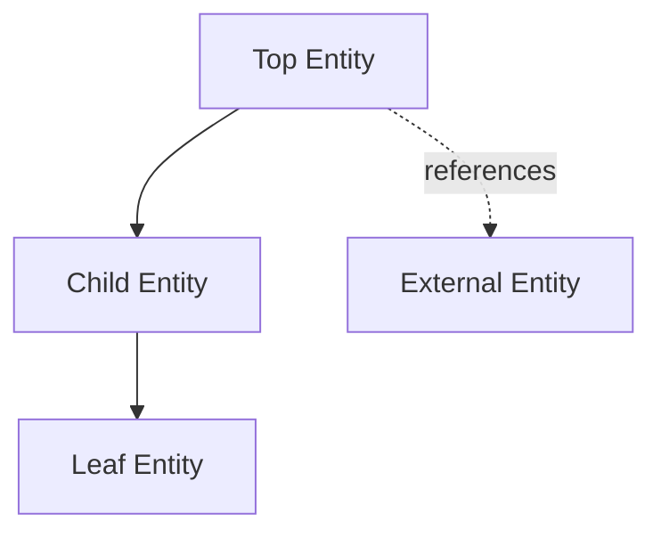
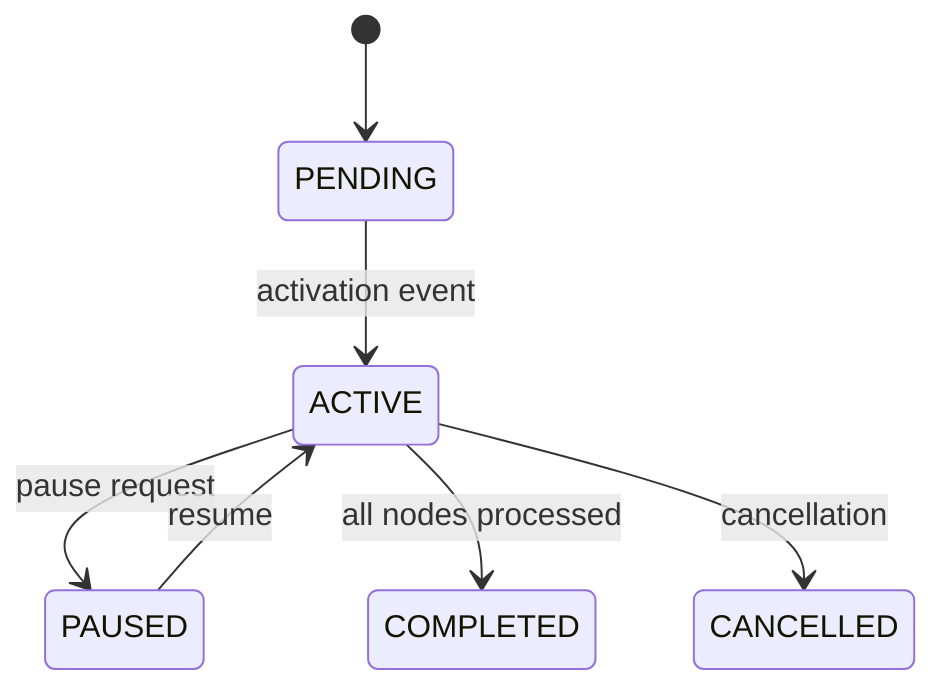

# Domain Model Exploration

Use this lens when the user wants to understand entity relationships, state machines, or domain modeling within a service.

## Approach

### 1. Identify the Entity Hierarchy

Start from the top-level entity and work down. For each entity:

- **What it represents** in business terms (one sentence)
- **Key fields** that drive behavior (status, type, foreign keys — skip audit fields like created_at)
- **Relationships** to other entities (owns, belongs to, references)
- **Lifecycle** — how it gets created, what states it passes through, how it ends

Present the hierarchy as a Mermaid diagram first, then explain each level. Example structure:

### 2. Map State Machines

Most production entities have a status field that encodes a state machine. For each stateful entity:

1. Find the status enum (in proto definitions, TypeScript types, or database schema)
2. Find the transition logic (usually in the main business logic file or a dedicated state machine)
3. Draw the state machine:

4. For each transition, note:
   - What triggers it (user action, system event, time-based)
   - What side effects it produces (events published, records created)
   - What validation guards it (preconditions that must be true)

### 3. Explain Modeling Decisions

Look for these patterns and explain why they exist:

| Pattern | Why it matters |
|---------|---------------|
| **Immutable ledger** (append-only log instead of mutable row) | Audit trail, temporal queries, conflict-free state reconstruction |
| **Soft deletes** (status = UNAVAILABLE instead of DELETE) | Referential integrity, historical data preservation |
| **Denormalization** (duplicated fields across tables) | Query performance, avoiding joins in hot paths |
| **Linked lists in DB** (next_node_id pointers) | Ordered sequences that need insertion/reordering without renumbering |
| **Sync groups** (coordination entities across related records) | Atomic operations that span multiple independent state machines |

### 4. Show How Entities Connect to Tests

Test fixtures are often the clearest documentation of how entities relate. Point the user to:
- Factory functions that create valid entity graphs
- Test setup that shows the minimum viable entity constellation
- Edge case tests that reveal business constraints not obvious from the schema

## Exploration Questions Template

After explaining a domain model, suggest questions like:
- "What happens to [child entity] when [parent entity] changes state?"
- "How does the system handle [entity] that gets stuck in [intermediate state]?"
- "What business rule prevents [seemingly valid but actually invalid state combination]?"
