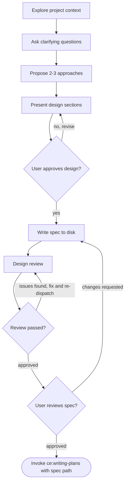

# Brainstorming Ideas Into Designs

Turn ideas into fully formed designs through natural collaborative dialogue.

Start by understanding the current project context, then ask questions one at a time to refine the idea. Once the design is clear, present it and get user approval.

<HARD-GATE>
Do NOT invoke any implementation skill, write any code, scaffold any project, or take any implementation action until a design has been presented and the user has approved it. This applies to EVERY project regardless of perceived simplicity.
</HARD-GATE>

## Anti-Pattern: "This Is Too Simple To Need A Design"

Every project goes through this process. A todo list, a single-function utility, a config change — all of them. "Simple" projects are where unexamined assumptions cause the most wasted work. The spec block should be proportional to the project's complexity — a simple project still gets all fields, but each field can be a single sentence. But the design MUST be presented and approved.

## Checklist

Complete these steps in order:

1. **Explore project context** — check files, docs, recent commits
2. **Ask clarifying questions** — one at a time, understand purpose/constraints/success criteria
3. **Propose 2-3 approaches** — with trade-offs and a recommendation
4. **Present design** — in sections scaled to complexity, get user approval after each section
5. **Write spec to disk** — format the approved design as a structured spec, save to `docs/specs/YYYY-MM-DD-<topic>-design.md`, and commit
6. **Design review** — dispatch the **devils-advocate** agent to review the spec file; fix issues and re-dispatch until approved (max 3 iterations, then surface to the user)
7. **User reviews spec** — ask the user to review the spec file before proceeding
8. **Invoke writing-plans** — pass the spec file path to **writing-plans** to create the implementation plan

## Process Flow



The terminal state is invoking **writing-plans** with the spec file path. Do NOT invoke any other implementation skill. The ONLY skill invoked after brainstorming is **writing-plans**.

## The Process

**Understanding the idea:**

- Check out the current project state first (files, docs, recent commits)
- Before asking detailed questions, assess scope: if the request describes multiple independent subsystems (e.g., "build a platform with chat, file storage, billing, and analytics"), flag this immediately. Do not spend questions refining details of a project that needs to be decomposed first.
- If the project is too large for a single spec, help the user decompose into sub-projects: what are the independent pieces, how do they relate, what order should they be built? Then brainstorm the first sub-project through the normal design flow. Each sub-project gets its own spec, plan, and implementation cycle.
- For appropriately-scoped projects, ask questions one at a time to refine the idea
- Prefer multiple choice questions when possible, but open-ended is fine too
- Only one question per message — if a topic needs more exploration, break it into multiple questions
- Focus on understanding: purpose, constraints, success criteria

**Exploring approaches:**

- Propose 2-3 different approaches with trade-offs
- Present options conversationally with a recommendation and reasoning
- Lead with the recommended option and explain why

**Presenting the design:**

- Once the idea is understood, present the design
- Scale each section to its complexity: a few sentences if straightforward, up to 200-300 words if nuanced
- Ask after each section whether it looks right so far
- Cover: architecture, components, data flow, error handling, testing
- Be ready to go back and clarify if something does not make sense

**Design for isolation and clarity:**

- Break the system into smaller units that each have one clear purpose, communicate through well-defined interfaces, and can be understood and tested independently
- For each unit, answer: what does it do, how do you use it, and what does it depend on?
- Can someone understand what a unit does without reading its internals? Can the internals change without breaking consumers? If not, the boundaries need work.
- Smaller, well-bounded units are also easier to work with — reasoning is better about code that fits in context at once, and edits are more reliable when files are focused. When a file grows large, that is often a signal that it is doing too much.

**Working in existing codebases:**

- Explore the current structure before proposing changes. Follow existing patterns.
- Where existing code has problems that affect the work (e.g., a file that has grown too large, unclear boundaries, tangled responsibilities), include targeted improvements as part of the design — the way a good developer improves code they are working in.
- Do not propose unrelated refactoring. Stay focused on what serves the current goal.

## After the Design

**Write the spec to disk:**

Format the approved design into this structure and save to `docs/specs/YYYY-MM-DD-<topic>-design.md` (user preferences for spec location override this default). Commit the spec file to git.

```markdown
# [Topic] Design Spec

**Problem:** [Derived from the "purpose" discussion — what's broken/missing/needed]

**Goal:** [Derived from success criteria discussion — what the end state looks like]

**Scope:** [What's in and out, derived from constraints discussion]

**Constraints:** [Non-functional requirements — performance targets, compatibility, tech stack mandates]

**Success Criteria:**
- [ ] [Each measurable criterion from the design]

**Design Decisions:**
- [Key architecture/approach decisions made during brainstorming]
- [Trade-offs considered and why this approach was chosen]

**Context Files:**
- [Files explored during brainstorming that are relevant to implementation]
```

**Design review:**

After writing the spec:

1. Dispatch the **devils-advocate** agent to review the spec file
2. If issues found: fix, re-dispatch, repeat until approved
3. If the loop exceeds 3 iterations, surface to the user for guidance

**User review gate:**

After the design review passes, ask the user to review the written spec:

> "Spec written and committed to `<path>`. Please review it and let me know if you want to make any changes before we move to planning."

Wait for the user's response. If they request changes, make them and re-run the design review. Only proceed once the user approves.

**Invoke writing-plans:**

Pass the spec file path to **writing-plans**. Do NOT invoke any other skill.

## Key Principles

- **One question at a time** — Do not overwhelm with multiple questions
- **Multiple choice preferred** — Easier to answer than open-ended when possible
- **YAGNI ruthlessly** — Remove unnecessary features from all designs
- **Explore alternatives** — Always propose 2-3 approaches before settling
- **Incremental validation** — Present design, get approval before moving on
- **Be flexible** — Go back and clarify when something does not make sense
