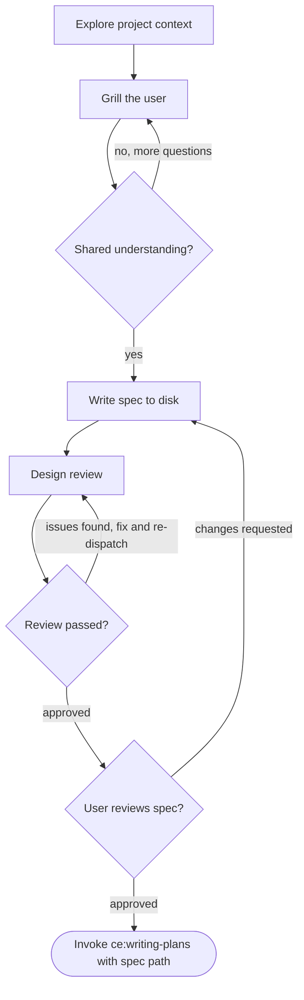

# Grilling

Build deep shared understanding of a feature through targeted questioning, then produce a structured spec for planning.

Unlike brainstorming (which explores *what* to build when the user is unsure), grilling assumes the user already has a direction. The goal is to close the communication gap — make sure the agent understands the user's intent precisely before any planning begins.

<HARD-GATE>
Do NOT invoke any implementation skill, write any code, scaffold any project, or take any implementation action until grilling is complete and a spec has been written. This applies regardless of how clear the feature seems.
</HARD-GATE>

## Checklist

Complete these steps in order:

1. **Explore project context** — check files, docs, recent commits relevant to the feature
2. **Grill the user** — ask targeted questions one at a time until shared understanding is reached
3. **Write spec to disk** — format the understanding as a structured spec, save and commit
4. **Design review** — dispatch the **devils-advocate** agent to review the spec; fix issues and re-dispatch until approved (max 3 iterations, then surface to the user)
5. **User reviews spec** — ask the user to review the spec file before proceeding
6. **Invoke writing-plans** — pass the spec file path to **writing-plans** to create the implementation plan

## Process Flow



The terminal state is invoking **writing-plans** with the spec file path. Do NOT invoke any other implementation skill.

## The Grilling Process

**Start with the codebase, not the user:**

Before asking any questions, explore the project context. Read files, docs, and recent commits relevant to the feature area. Answer as many questions as you can from the code itself — don't ask the user what you can discover.

**Ask questions one at a time:**

- One question per message. Wait for the answer before continuing.
- For each question, provide your recommended answer based on what you've learned from the codebase and conversation so far. This gives the user something concrete to react to rather than answering from scratch.
- Prefer multiple choice when possible, but open-ended is fine for nuanced topics.

**What to grill on:**

- **Intent** — what problem does this solve, who benefits, what does success look like?
- **Boundaries** — what's in scope, what's explicitly out, where does this touch other systems?
- **Constraints** — performance targets, compatibility requirements, tech stack mandates
- **Behaviour** — edge cases, error states, what happens when things go wrong
- **Existing patterns** — how does this fit with what's already in the codebase?

**Suggest alternatives to deepen understanding:**

When you spot potential issues or better approaches, suggest them. Not to explore alternatives (the user has a direction), but as a tool for understanding *why* they chose their approach. If they decline, their reasoning reveals intent that pure Q&A might miss.

**Know when to stop:**

Grilling is complete when you can confidently describe the feature back to the user — its purpose, boundaries, constraints, and key behaviours — and they agree. Don't over-grill simple features.

## After the Grilling

**Write the spec to disk:**

Format the shared understanding into this structure and save to `docs/specs/YYYY-MM-DD-<topic>-design.md` (user preferences for spec location override this default). Commit the spec file to git.

```markdown
# [Topic] Design Spec

**Problem:** [What's broken, missing, or needed — from the user's stated intent]

**Goal:** [What the end state looks like — from the success criteria discussion]

**Scope:** [What's in and out — from the boundaries discussion]

**Constraints:** [Non-functional requirements — from the constraints discussion]

**Success Criteria:**
- [ ] [Each measurable criterion established during grilling]

**Design Decisions:**
- [Key decisions surfaced during grilling and why]
- [Alternatives considered and why they were declined]

**Context Files:**
- [Files explored during grilling that are relevant to implementation]
```

**Design review:**

After writing the spec:

1. Dispatch the **devils-advocate** agent to review the spec file
2. If issues found: fix, re-dispatch, repeat until approved
3. If the loop exceeds 3 iterations, surface to the user for guidance

**User review gate:**

After the design review passes, ask the user to review the written spec:

> "Spec written and committed to `<path>`. Please review it and let me know if you want to make any changes before we move to planning."

Wait for the user's response. If they request changes, make them and re-run the design review. Only proceed once the user approves.

**Invoke writing-plans:**

Pass the spec file path to **writing-plans**. Do NOT invoke any other skill.
