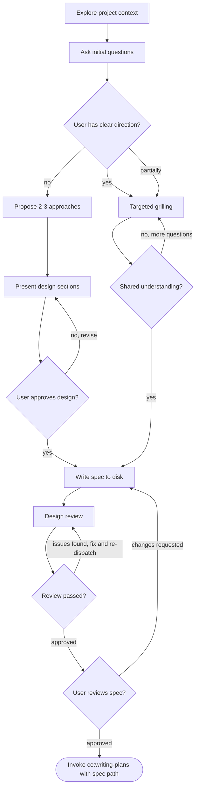

# Grilling

Build deep shared understanding of a feature through targeted questioning, then produce a structured spec for planning.

A single entry point for pre-planning work. After exploring the codebase and asking a few initial questions, the process adapts: if the user has a clear direction, it focuses on closing the communication gap through targeted grilling; if the direction is unclear, it shifts into approach exploration before converging on a design.

<HARD-GATE>
Do NOT invoke any implementation skill, write any code, scaffold any project, or take any implementation action until a spec has been written and approved. This applies regardless of how clear the feature seems.
</HARD-GATE>

## Anti-Pattern: "This Is Too Simple To Need A Design"

Every project goes through this process. A todo list, a single-function utility, a config change — all of them. "Simple" projects are where unexamined assumptions cause the most wasted work. The spec should be proportional to the project's complexity — a simple project still gets all fields, but each field can be a single sentence. But the design MUST be presented and approved.

## Checklist

Complete these steps in order:

1. **Explore project context** — check files, docs, recent commits relevant to the feature
2. **Assess clarity** — ask initial questions to determine if the user has a clear direction or needs exploration
3. **Grill or explore** — targeted questioning if direction is clear; propose approaches if not
4. **Present design** — if approaches were explored, present design sections scaled to complexity and get approval
5. **Write spec to disk** — format the understanding as a structured spec, save and commit
6. **Design review** — dispatch the **devils-advocate** agent to review the spec; fix issues and re-dispatch until approved (max 3 iterations, then surface to the user)
7. **User reviews spec** — ask the user to review the spec file before proceeding
8. **Invoke writing-plans** — pass the spec file path to **writing-plans** to create the implementation plan

## Process Flow



The terminal state is invoking **writing-plans** with the spec file path. Do NOT invoke any other implementation skill.

## Phase 1: Explore Context

**Start with the codebase, not the user:**

Before asking any questions, explore the project context. Read files, docs, and recent commits relevant to the feature area. Answer as many questions as you can from the code itself — don't ask the user what you can discover.

**Assess scope early:**

Before asking detailed questions, assess scope: if the request describes multiple independent subsystems (e.g., "build a platform with chat, file storage, billing, and analytics"), flag this immediately. Do not spend questions refining details of a project that needs to be decomposed first.

If the project is too large for a single spec, help the user decompose into sub-projects: what are the independent pieces, how do they relate, what order should they be built? Then grill on the first sub-project through the normal flow. Each sub-project gets its own spec, plan, and implementation cycle.

## Phase 2: The Questioning Process

**Ask questions one at a time:**

- One question per message. Wait for the answer before continuing.
- For each question, provide your recommended answer based on what you've learned from the codebase and conversation so far. This gives the user something concrete to react to rather than answering from scratch.
- Prefer multiple choice when possible, but open-ended is fine for nuanced topics.

**Detect the user's clarity level early:**

After 2-3 initial questions, you'll know whether the user has a clear direction or is still exploring. Don't ask them to classify themselves — infer it from their answers:

- **Clear direction**: They give specific, confident answers. They know what they want and why. → Shift to targeted grilling (Phase 2a).
- **Exploring**: Answers are tentative, they ask "what do you think?", or they describe a problem without a solution. → Shift to approach exploration (Phase 2b).
- **Mixed**: Some aspects are clear, others aren't. → Grill on the clear parts, explore the uncertain ones.

Conversations drift. A user might start clear and realize they're unsure about the approach mid-grill. Or start fuzzy and crystallize quickly. Adapt as you go — there's no wrong transition.

### Phase 2a: Targeted Grilling

When the user has a direction, the goal is to close the communication gap — make sure the agent understands the user's intent precisely.

**What to grill on:**

- **Intent** — what problem does this solve, who benefits, what does success look like?
- **Boundaries** — what's in scope, what's explicitly out, where does this touch other systems?
- **Constraints** — performance targets, compatibility requirements, tech stack mandates
- **Behaviour** — edge cases, error states, what happens when things go wrong
- **Existing patterns** — how does this fit with what's already in the codebase?

**Suggest alternatives to deepen understanding:**

When you spot potential issues or better approaches, suggest them. Not to explore alternatives (the user has a direction), but as a tool for understanding *why* they chose their approach. If they decline, their reasoning reveals intent that pure Q&A might miss.

**Know when to stop:**

Grilling is complete when you can confidently describe the feature back to the user — its purpose, boundaries, constraints, and key behaviours — and they agree. Don't over-grill simple features.

### Phase 2b: Approach Exploration

When the user is still figuring out what to build, help them converge on a direction.

**Exploring approaches:**

- Propose 2-3 different approaches with trade-offs
- Present options conversationally with a recommendation and reasoning
- Lead with the recommended option and explain why

**Presenting the design:**

- Once the idea is understood, present the design
- Scale each section to its complexity: a few sentences if straightforward, up to 200-300 words if nuanced
- Ask after each section whether it looks right so far
- Cover: architecture, components, data flow, error handling, testing
- Be ready to go back and clarify if something does not make sense

**Design for isolation and clarity:**

- Break the system into smaller units that each have one clear purpose, communicate through well-defined interfaces, and can be understood and tested independently
- For each unit, answer: what does it do, how do you use it, and what does it depend on?
- Can someone understand what a unit does without reading its internals? Can the internals change without breaking consumers? If not, the boundaries need work.
- Smaller, well-bounded units are also easier to work with — reasoning is better about code that fits in context at once, and edits are more reliable when files are focused. When a file grows large, that is often a signal that it is doing too much.

**Working in existing codebases:**

- Explore the current structure before proposing changes. Follow existing patterns.
- Where existing code has problems that affect the work (e.g., a file that has grown too large, unclear boundaries, tangled responsibilities), include targeted improvements as part of the design — the way a good developer improves code they are working in.
- Do not propose unrelated refactoring. Stay focused on what serves the current goal.

## After the Questioning

**Write the spec to disk:**

Format the shared understanding into this structure and save to `plans/design-YYYY-MM-DD-<topic>.md` (user preferences for spec location override this default). Commit the spec file to git.

```markdown
# [Topic] Design Spec

**Problem:** [What's broken, missing, or needed — from the user's stated intent]

**Goal:** [What the end state looks like — from the success criteria discussion]

**Scope:** [What's in and out — from the boundaries discussion]

**Constraints:** [Non-functional requirements — from the constraints discussion]

**Success Criteria:**
- [ ] [Each measurable criterion established during the process]

**Design Decisions:**
- [Key decisions surfaced during the process and why]
- [Alternatives considered and why they were declined]

**Context Files:**
- [Files explored that are relevant to implementation]
```

**Design review:**

After writing the spec:

1. Dispatch the **devils-advocate** agent to review the spec file
2. If issues found: fix, re-dispatch, repeat until approved
3. If the loop exceeds 3 iterations, surface to the user for guidance

**User review gate:**

After the design review passes, ask the user to review the written spec:

> "Spec written and committed to `<path>`. Please review it and let me know if you want to make any changes before we move to planning."

Wait for the user's response. If they request changes, make them and re-run the design review. Only proceed once the user approves.

**Invoke writing-plans:**

Pass the spec file path to **writing-plans**. Do NOT invoke any other skill.

## Key Principles

- **One question at a time** — Do not overwhelm with multiple questions
- **Multiple choice preferred** — Easier to answer than open-ended when possible
- **YAGNI ruthlessly** — Remove unnecessary features from all designs
- **Adapt to clarity** — Grill when the user is clear, explore when they're not
- **Incremental validation** — Present design, get approval before moving on
- **Be flexible** — Go back and clarify when something does not make sense
