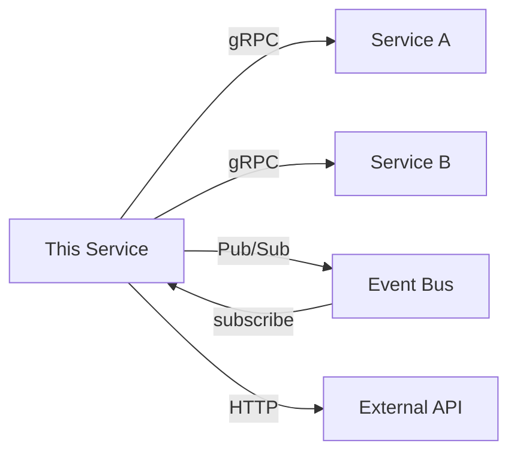

# Integrations Exploration

Use this lens when the user wants to understand how the service connects to external systems — other microservices, third-party APIs, feature flags, and observability.

## Approach

### 1. Map the Service Dependencies

Find the service context / dependency injection site and list every external dependency:

| Dependency type | How to find it | What to explain |
|----------------|---------------|-----------------|
| **gRPC clients** | Service context field, proto imports | What each client is used for, which RPCs are called |
| **Pub/Sub** | Topic/subscription constants, handler registrations | What events are published and consumed |
| **Feature flags** | LaunchDarkly client usage, flag key strings | What behavior each flag controls, what the default is |
| **External APIs** | HTTP client setup, SDK imports | Third-party services (Stripe, Twilio, etc.) |

Present this as a dependency diagram:

### 2. Explain Each Integration's Contract

For each dependency, cover:

- **What the service asks of it** — which methods/events, with what data
- **What assumptions the service makes** — response format, latency expectations, availability
- **What happens when it's unavailable** — retry logic, fallback behavior, error propagation
- **How it's mocked in tests** — understanding the mock reveals the contract

### 3. Feature Flag Patterns

Feature flags in microservices aren't just on/off switches. Explain:

- **Flag evaluation context** — what attributes are passed (customer ID, brand, region)
- **Targeting rules** — some flags target specific brands or customer segments
- **Kill switches** — flags that exist purely to disable a feature in production
- **Migration flags** — flags that route between old and new code paths during rollouts

### 4. Observability Integration

If the service has tracing, metrics, or structured logging:

- **Trace spans** — what operations are instrumented, what tags are attached
- **Metrics** — custom metrics beyond standard gRPC metrics
- **Structured logging** — log fields that aid debugging (IDs, statuses, timing)

This matters for onboarding because observability code reveals what the team considers important to monitor — which indirectly tells you what breaks.

### 5. Cross-Service Patterns (Go vs TypeScript)

| Concern | Go pattern | TypeScript pattern |
|---------|-----------|-------------------|
| gRPC client setup | `grpc.Dial` + interceptors | `nice-grpc` + `createChannel` |
| Pub/Sub publishing | Custom publisher wrapper | `@eucalyptusvc/lib-pubsub` |
| Feature flags | `ldclient.BoolVariation` | `launchDarkly.variation()` |
| Tracing | OpenTelemetry SDK | `@eucalyptusvc/lib-tracer` |
| Config | Env vars via `envconfig` | Env vars via `process.env` |

## Exploration Questions Template

After mapping integrations, suggest questions like:
- "What would happen to this service if [dependency] went down for 5 minutes?"
- "How does the team roll out changes that affect both this service and [dependent service]?"
- "Which of these integrations are on the critical path vs. fire-and-forget?"
